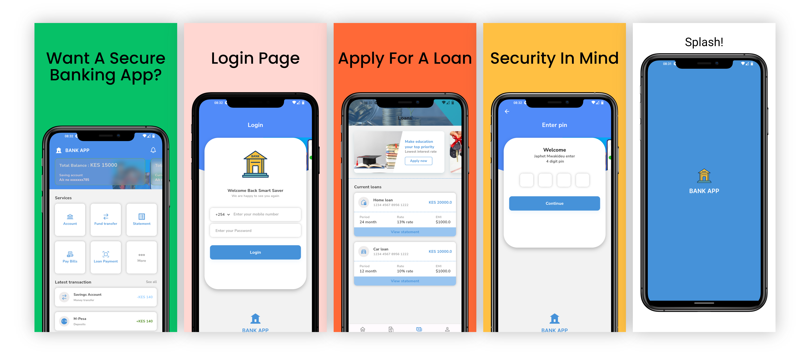
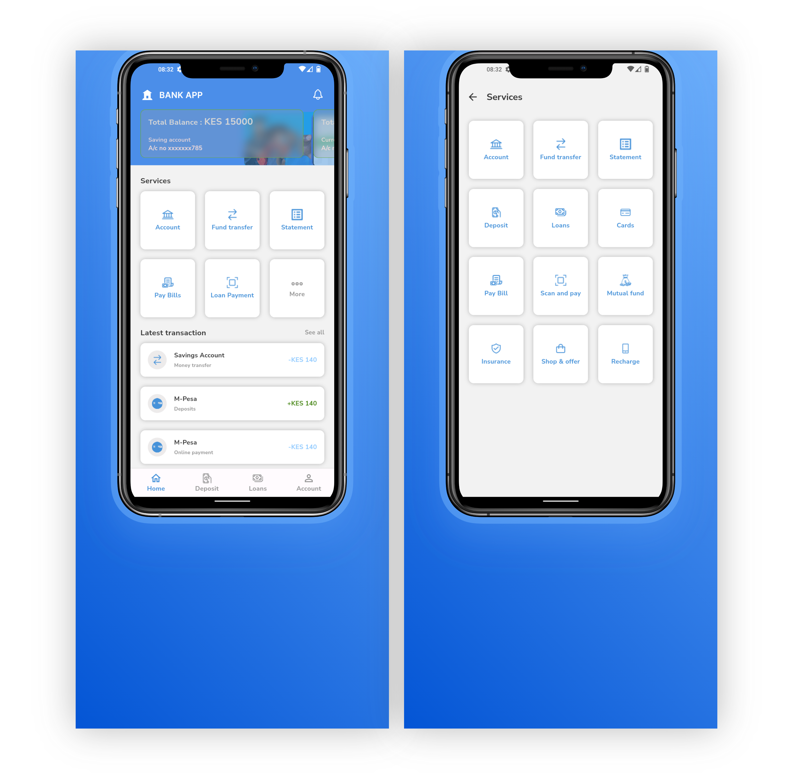
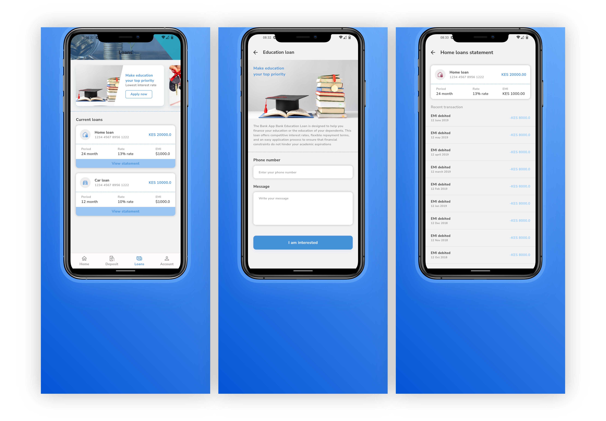
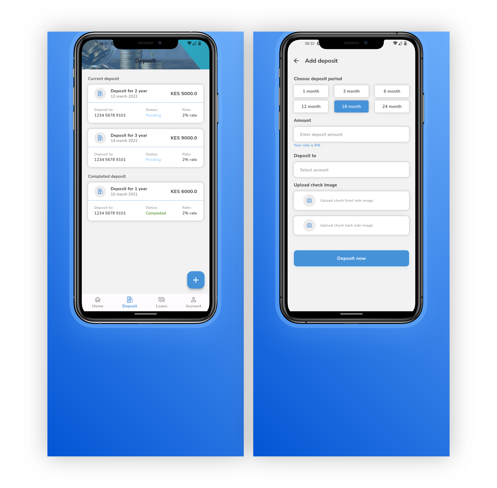
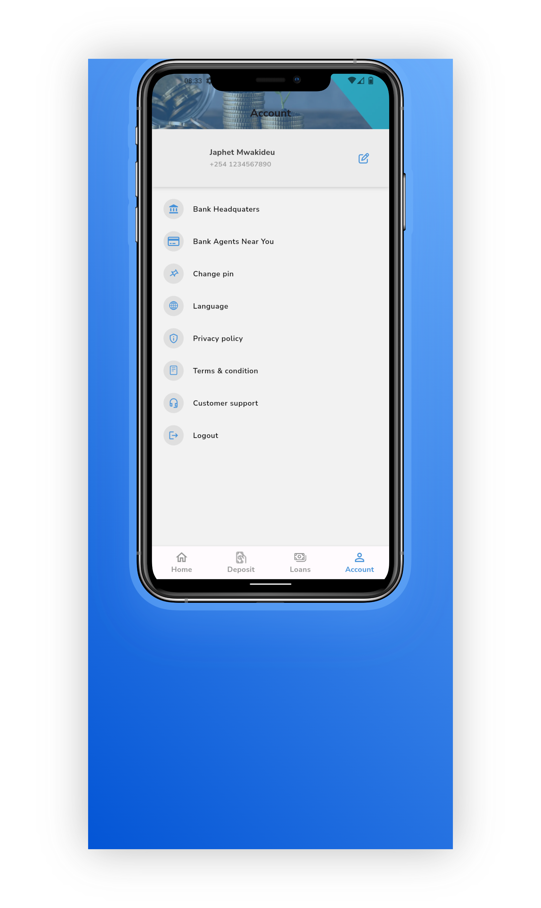

# 🚀Secure Bank App! 🚀

A cutting-edge bank mobile app, designed with the highest cybersecurity standards in mind. In today's digital age, the security of financial transactions and personal information is paramount. That's why we have implemented a comprehensive suite of security features to ensure our users can bank with confidence.

## 🔐 Key Security Features Implemented:

### Multi-Factor Authentication (MFA)
- Adds an extra layer of security by requiring users to verify their identity through multiple methods before accessing their account.

### End-to-End Encryption
- Ensures that all data transmitted between the user’s device and our servers is encrypted, protecting it from interception and tampering.

### Biometric Authentication
- Utilizes fingerprint and facial recognition for secure and convenient access to the app.

### Secure Communication Channels
- Implements SSL/TTLS protocols to secure all communications and data exchanges within the app.

### Real-Time Fraud Detection
- Employs advanced machine learning algorithms to detect and prevent real-time fraudulent activities.

### Regular Security Audits and Penetration Testing
- Conducts frequent security assessments and penetration tests to identify and address vulnerabilities proactively.

### Secure Coding Practices
- Follows industry best practices in secure software development to minimize risks and vulnerabilities from the outset.

### Data Masking
- Masks sensitive data displayed within the app to protect user privacy and prevent unauthorized access.

### Session Management
- Ensures secure session handling and automatic session expiration to protect user accounts.

### Device Binding
- Binds user accounts to their specific devices, adding an extra layer of security against unauthorized access.

### Account Activity Monitoring
- Provides users with detailed logs of account activities and alerts them to any suspicious behavior.

### Remote Logout and Account Locking
- Allows users to remotely log out and lock their accounts in case of lost or stolen devices.

### Regular Software Updates
- Ensures the app is always up-to-date with the latest security patches and improvements.

### Comprehensive Privacy Policies
- Maintains transparent privacy policies to inform users how their data is collected, used, and protected.

### User Education and Awareness
- Provides in-app education and tips on how to maintain security and avoid phishing attacks.

With these robust security measures in place, our new bank mobile app offers a secure and seamless banking experience, giving our users the peace of mind they deserve.

## Features

### Splash Screen

### Onboarding
- User-friendly onboarding process to guide new users through the setup and registration.

### Home Page
- Overview of account balance, recent transactions, and quick access to main features.

### Loans
- Easy application process for personal and business loans with real-time status updates.

### Deposit
- Securely deposit checks using the mobile camera and manage deposit accounts efficiently.

### Account Management
- Detailed account information, transaction history, and customizable alerts.

## Download
- [GitHub Repository](https://github.com/JayMwakideu/Banking_Sacco_App.git)
- Download the APK from [Google Drive](https://drive.google.com/file/d/198Cs7bvSFD-guMM0xeWTPKtvevZct3jC/view?usp=sharing)

## Support Me
If you like my work, consider buying me a coffee:

## License

| Component | Licensing |
|-----------|-----------|
| Mobile App | MIT License |

MIT License

© 2024 Jaylan Solutions

Permission is hereby granted, free of charge, to any person obtaining a copy
of this software and associated documentation files (the "Software"), to deal
in the Software without restriction, including without limitation the rights
to use, copy, modify, merge, publish, distribute, sublicense, and/or sell
copies of the Software, and to permit persons to whom the Software is
furnished to do so, subject to the following conditions:

The above copyright notice and this permission notice shall be included in all
copies or substantial portions of the Software.

THE SOFTWARE IS PROVIDED "AS IS", WITHOUT WARRANTY OF ANY KIND, EXPRESS OR
IMPLIED, INCLUDING BUT NOT LIMITED TO THE WARRANTIES OF MERCHANTABILITY,
FITNESS FOR A PARTICULAR PURPOSE AND NONINFRINGEMENT. IN NO EVENT SHALL THE
AUTHORS OR COPYRIGHT HOLDERS BE LIABLE FOR ANY CLAIM, DAMAGES OR OTHER
LIABILITY, WHETHER IN AN ACTION OF CONTRACT, TORT OR OTHERWISE, ARISING FROM,
OUT OF OR IN CONNECTION WITH THE SOFTWARE OR THE USE OR OTHER DEALINGS IN THE
SOFTWARE.

## Acknowledgments

I want to express my sincere gratitude to 

## Contributors
- Jaylan Solutions
- Japhet Mwakideu

I'm incredibly proud of the team's hard work and dedication to bringing this project to life. Together, we're setting new standards for cybersecurity in mobile banking. 💪

